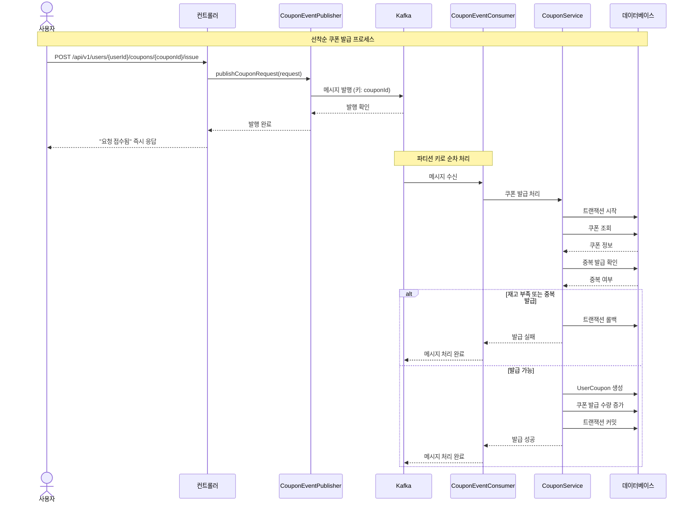
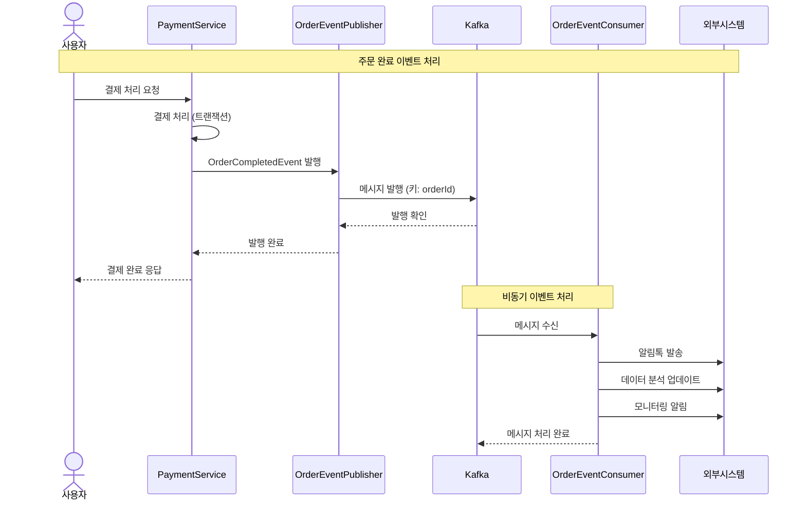

# 카프카를 활용한 비즈니스 프로세스 개선 설계 문서

## 1. 개요

### 1.1 개선 목표
- **선착순 쿠폰 발급 시스템**: 동시성 제어 및 순차 처리 보장
- **실시간 주문 정보 발행 시스템**: 비동기 이벤트 처리 및 확장성 확보

### 1.2 카프카 활용 전략
- **Producer-Consumer 패턴**: 비동기 메시지 처리
- **파티션 키 활용**: 순차 처리 보장
- **트랜잭션 이벤트**: 데이터 일관성 유지

## 2. 카프카 구성 설계

### 2.1 카프카 클러스터 구성
```yaml
# docker-compose.yml
version: '3.8'
services:
  zookeeper:
    image: confluentinc/cp-zookeeper:7.4.0
    environment:
      ZOOKEEPER_CLIENT_PORT: 2181
      ZOOKEEPER_TICK_TIME: 2000
    ports:
      - "2181:2181"

  kafka:
    image: confluentinc/cp-kafka:7.4.0
    depends_on:
      - zookeeper
    ports:
      - "9092:9092"
    environment:
      KAFKA_BROKER_ID: 1
      KAFKA_ZOOKEEPER_CONNECT: zookeeper:2181
      KAFKA_ADVERTISED_LISTENERS: PLAINTEXT://localhost:9092
      KAFKA_OFFSETS_TOPIC_REPLICATION_FACTOR: 1
      KAFKA_AUTO_CREATE_TOPICS_ENABLE: 'true'
```

### 2.2 토픽 설계

| 토픽명 | 파티션 수 | 복제 팩터 | 키 타입 | 설명 |
|--------|-----------|-----------|---------|------|
| `coupon-publish-request` | 3 | 1 | String (couponId) | 쿠폰 발급 요청 |
| `order-completed` | 3 | 1 | String (orderId) | 주문 완료 이벤트 |

### 2.3 Consumer Group 설계

| Consumer Group | 토픽 | 인스턴스 수 | 처리 방식 |
|----------------|------|-------------|-----------|
| `coupon-consumer-group` | `coupon-publish-request` | 1 | 순차 처리 |
| `order-consumer-group` | `order-completed` | 3 | 병렬 처리 |

## 3. 비즈니스 시퀀스 다이어그램

### 3.1 선착순 쿠폰 발급 시스템



### 3.2 실시간 주문 정보 발행 시스템



## 4. 카프카 설정

### 4.1 Producer 설정
```java
@Configuration
@EnableKafka
public class KafkaConfig {
    
    @Bean
    public ProducerFactory<String, String> producerFactory() {
        Map<String, Object> configProps = new HashMap<>();
        configProps.put("bootstrap.servers", "localhost:9092");
        configProps.put("key.serializer", "org.apache.kafka.common.serialization.StringSerializer");
        configProps.put("value.serializer", "org.apache.kafka.common.serialization.StringSerializer");
        return new DefaultKafkaProducerFactory<>(configProps);
    }
    
    @Bean
    public KafkaTemplate<String, String> kafkaTemplate() {
        return new KafkaTemplate<>(producerFactory());
    }
}
```

### 4.2 Consumer 설정
```java
@Bean
public ConsumerFactory<String, String> consumerFactory() {
    Map<String, Object> configProps = new HashMap<>();
    configProps.put("bootstrap.servers", "localhost:9092");
    configProps.put("group.id", "coupon-consumer-group");
    configProps.put("key.deserializer", "org.apache.kafka.common.serialization.StringDeserializer");
    configProps.put("value.deserializer", "org.apache.kafka.common.serialization.StringDeserializer");
    configProps.put("auto.offset.reset", "earliest");
    return new DefaultKafkaConsumerFactory<>(configProps);
}
```


